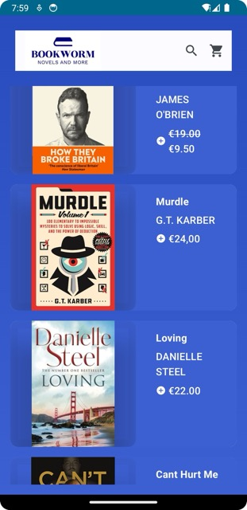

# Book Worm - Bookshop Prototype

## Introduction

...

<details>
  <summary><strong>Getting Started</strong></summary>

  To run the Book Worm prototype on your local machine, follow these steps:

  1. **Clone the repository:**
     ```bash
     git clone https://github.com/smiichyk/Book-Worm.git
     ```

  2. **Open the project in Android Studio.**

  3. **Run the app on an Android emulator or a physical device.**
</details>

<details>
  <summary><strong>Features</strong></summary>

  - **Homepage:** The app features a dynamic homepage with a gradient background that creates an immersive visual experience.

  - **Top App Bar:** A custom Top App Bar showcases the Book Worm logo and provides quick access to search and the shopping cart.

  - **Book Listings:** Books are displayed in a scrollable list, each with an image, title, author, and price. Users can click on a book item to explore further details.

  - **Book Item Card:** The book item card is designed with a sleek appearance, featuring the book cover image, title, author, and pricing information. Users can also view discounted prices if applicable.
</details>

<details>
  <summary><strong>Screenshots</strong></summary>

  

  *Fig. 1 - Book Worm Homepage*

...

<details>
  <summary><strong>License</strong></summary>

  This project is licensed under the [MIT License](LICENSE).
</details>

...
